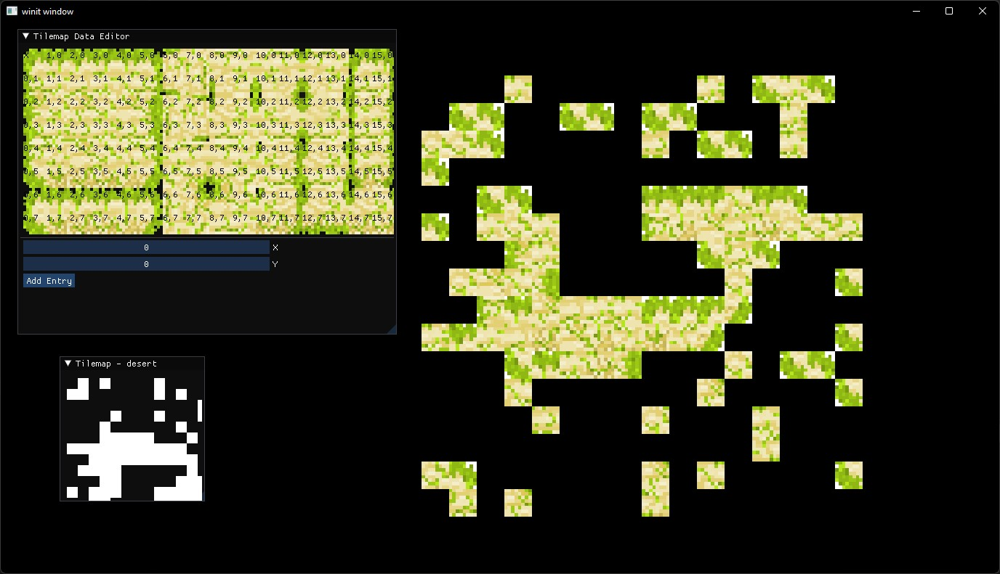

# Mole man 2

Sequel to Mole Man, a very bad game I made during lunch during GCSEs

## Change log

First steps:
- Gotten Vulkano running in rust with a window and a triangle
- Connected Dear ImGui by fixing a very outdated integration module
- Started tilemap renderer by instancing square meshes
